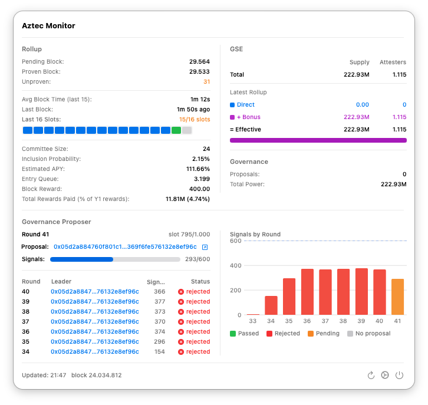
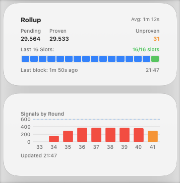

# Aztec Monitor

A macOS menu bar app for monitoring the Aztec network. Track rollup status, governance proposals, and staking metrics at a glance.


## Features

- **Rollup Status** - Pending/proven blocks, average block time, slot utilization
- **Staking Metrics** - Committee size, inclusion probability, estimated APY, entry queue
- **Governance Proposer** - Current round, proposal signals, historical round data
- **GSE (Staking)** - Total supply, attesters, direct vs bonus breakdown
- **Governance** - Active proposals and total voting power
- **macOS Widgets** - Desktop widgets for quick monitoring

### Light Mode



### Desktop Widget



## Installation

1. Download `aztec-monitor.zip` from the [latest release](../../releases/latest)
2. Unzip and drag `aztec-monitor.app` to your Applications folder
3. First launch: right-click the app and select "Open" (to bypass Gatekeeper for unsigned apps)

## Configuration

Click the gear icon in the app to configure:

- **RPC Endpoint** - Your Ethereum RPC URL (defaults to `localhost:8545`)
- **Contract Addresses** - Pre-configured for Aztec mainnet
- **Poll Interval** - How often to refresh data
- **Notifications** - Alerts for new proposals or quorum reached

You'll need access to an Ethereum node (local or remote RPC provider) to fetch on-chain data.

## Building from Source

Requires Xcode 15+ and macOS 14+.

```bash
# Clone the repo
git clone https://github.com/LHerskind/aztec-monitor.git
cd aztec-monitor

# Build release
./build-release.sh
```

The built app will be in `dist/aztec-monitor.app`.

## About

This app was built entirely with [Claude Code](https://claude.com/product/claude-code) by someone with zero Swift experience. You can just build things.

## License

MIT
